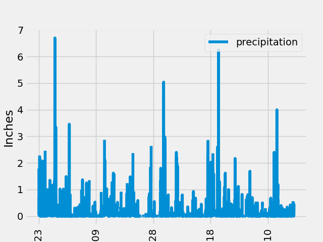
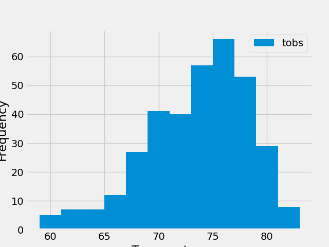

<h1>Sqlalchemy-challenge</h1>

<h2>Challenge 10 - SQLAlchemy and Flask</h2>

<h3>Project Summary</h3>

The assignment for this project was to perform an analysis of weather data for Hawaii for the past year, and make that information available via an API framework. The goal was to explore an understanding of the various tools available via python modules SqlAlchemy and Flask to retrieve data from a database and create a web application to support the API calls. 

<h3>Project Files</h3>
The following files were generated during the completion of this project:
<ul>
    <li>climate_starter.ipynb: Jupiter Notebook for data retrieval and analysis</li>
    <li>app.py: Python application for generating the web server and surfacing the various APIs</li>
    <li>precipitation.png: Graphical analysis of precipation data over the last 12 months of the dataset</li>
    <li>temps.png: Graphical analysis of temperature distribution over the last 12 months of the dataset</li>
</ul>

<h3>Data Analysis</h3>
<b>Precipitation:</b>

In reviewing the data and the plot (shown below) it would appear that precipitation remain varied throughout the year, with no season clearly identified as the "rainy season". There were 4 days tracking over 4" of rain, and they occurred across all seasons (September, February, April and July). A further exploration of the mean precipitation across seasons might reveal tendencies at certain time of the year.

 

<b>Temperature Distribution</b>

By creating a histogram showing the frequency for each temperature recorded over a one year period, it can be determined that Hawaii has a temperate climate. There a few readings below 60 degrees or above the low eighties. The temparature range that was recorded at least 20 times runs from the high 60's to the low 80's, with peaks occurring around 75 degrees. Regardless of the time of year visiting Hawaii, it can be safely assumed the temperature will be between 60 and 80 degrees Farenheit.

 

<h3>Project Instructions</h3>
Congratulations! You've decided to treat yourself to a long holiday vacation in Honolulu, Hawaii. To help with your trip planning, you decide to do a climate analysis about the area. The following sections outline the steps that you need to take to accomplish this task.

<b>Part 1: Analyze and Explore the Climate Data</b>

In this section, you’ll use Python and SQLAlchemy to do a basic climate analysis and data exploration of your climate database. Specifically, you’ll use SQLAlchemy ORM queries, Pandas, and Matplotlib. To do so, complete the following steps:

<ol>
    <li>Note that you’ll use the provided files (climate_starter.ipynb and hawaii.sqlite) to complete your climate analysis and data exploration.</li>
    <li>Use the SQLAlchemy create_engine() function to connect to your SQLite database.</li>
    <li>Use the SQLAlchemy automap_base() function to reflect your tables into classes, and then save references to the classes named station and measurement.</li>
    <li>Link Python to the database by creating a SQLAlchemy session.</li>
    <li>Perform a precipitation analysis and then a station analysis by completing the steps in the following two subsections.</li>
</ol>

<b>Precipitation Analysis</b>
<ol>
    <li>Find the most recent date in the dataset.</li>
    <li>Using that date, get the previous 12 months of precipitation data by querying the previous 12 months of data.</li>
    <li>Select only the "date" and "prcp" values.</li>
    <li>Load the query results into a Pandas DataFrame. Explicitly set the column names.</li>
    <li>Sort the DataFrame values by "date".</li>
    <li>Plot the results by using the DataFrame plot method, as the following image shows:</li>
    <li>Use Pandas to print the summary statistics for the precipitation data.</li>
</ol>

<b>Station Analysis</b>
<ol>
    <li>Design a query to calculate the total number of stations in the dataset.</li>
    <li>Design a query to find the most-active stations (that is, the stations that have the most rows). To do so, complete the following steps:</li>
    <ul>
        <li>List the stations and observation counts in descending order.</li>
        <li>Answer the following question: which station id has the greatest number of observations?</li>
    </ul>
    <li>Design a query that calculates the lowest, highest, and average temperatures that filters on the most-active station id found in the previous query.</li>
    <li>Design a query to get the previous 12 months of temperature observation (TOBS) data. To do so, complete the following steps:</li>
    <ul>
        <li>Filter by the station that has the greatest number of observations.</li>
        <li>Query the previous 12 months of TOBS data for that station.</li>
        <li>Plot the results as a histogram with bins=12, as the following image shows:</li>
    </ul>
    <li>Close your session.</li>
</ol>
<b>Part 2: Design Your Climate App</b>

Now that you’ve completed your initial analysis, you’ll design a Flask API based on the queries that you just developed. To do so, use Flask to create your routes as follows:

<ol>
    <li>"/"</li>
    <ul>
        <li>Start at the homepage.</li>
        <li>List all the available routes.</li>
    </ul>
    <li>/api/v1.0/precipitation</li>
    <ul>
        <li>Convert the query results from your precipitation analysis (i.e. retrieve only the last 12 months of data) to a dictionary using date as the key and prcp as the value.</li>
        <li>Return the JSON representation of your dictionary.</li>
    </ul>
    <li>/api/v1.0/stations</li>
    <ul>
        <li>Return a JSON list of stations from the dataset.</li>
    </ul>
    <li>/api/v1.0/tobs</li>
    <ul>
        <li>Query the dates and temperature observations of the most-active station for the previous year of data.</li>
        <li>Return a JSON list of temperature observations for the previous year.</li>
    </ul>
    <li>/api/v1.0/<start> and /api/v1.0/<start>/<end></li>
    <ul>
        <li>Return a JSON list of the minimum temperature, the average temperature, and the maximum temperature for a specified start or start-end range.</li>
        <li>For a specified start, calculate TMIN, TAVG, and TMAX for all the dates greater than or equal to the start date.</li>
        <li>For a specified start date and end date, calculate TMIN, TAVG, and TMAX for the dates from the start date to the end date, inclusive.</li>
    </ul>
</ol>
